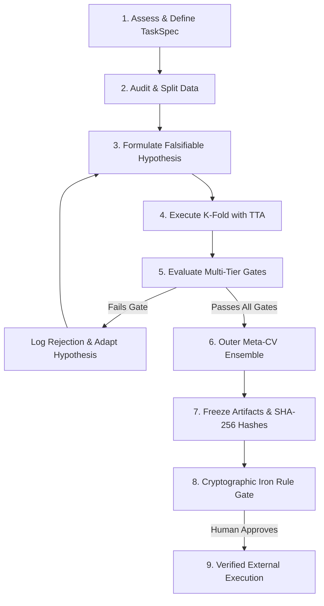

# Self-Improving AI/ML Framework: Agent Operating Runbook

This skill instructs you on how to architect, execute, and govern an autonomous, self-improving machine learning research loop. It replaces manual model tuning with an evidence-driven scientific process.

---

## The 7 Core Pillars

1. **Hypothesis Backlog & Adaptive Synthesis**: Hypotheses are defined in `configs/hypotheses.yaml`. The agent analyzes diagnostic failure modes to autonomously synthesize and register the next experiment.
2. **Leak-Free Grouped/Temporal Cross-Validation**: Splits are strictly partitioned by natural grouping or temporal keys (e.g. `prompt_id`, `patient_id`, `cutoff_timestamp`) with zero index overlap.
3. **Domain Invariance & Test-Time Augmentation (TTA)**: Enforces domain symmetries (e.g. response swap, spatial flips) during training and inference. Divergence is evaluated using Total Variation distance ($D_{\text{TV}} \le 0.10$).
4. **Multi-Tier Validation Gatekeeper & Anomaly Guardrails**: Every candidate must pass automated gates (Leakage, CV gain $\ge \Delta_{\min}$, $D_{\text{TV}}$ symmetry, ensemble diversity $r \le r_{\max}$, Shannon entropy collapse, and fold variance) before promotion.
5. **Post-Hoc Calibration Engine**: Optimizes probability sharpness and alignment via Temperature Scaling or Platt Scaling to minimize Expected Calibration Error (ECE).
6. **Convex Ensemble Blending with True Outer Meta-CV**: Solves simplex weights ($\sum w_m = 1, w_m \ge 0$) via SLSQP. Computes unbiased validation scores exclusively on outer held-out `meta_oof`, while refitting final weights on 100% of OOF data for test deployment only.
7. **Cryptographically Bound Iron Rule Authorization Gate**: The loop strictly halts before external submission or production push. Generates formal briefs bound to SHA-256 hashes of artifacts, predictions, and configurations, requiring verified human approval.

---

## Agent Operational Sequence

Follow this deterministic sequence when spinning up or running the framework:



### Step 1: Formulate `TaskSpec`
Declare the task type and probability semantics before writing modeling code:
- **Simplex Classification**: Multi-class softmax with $\sum p_c = 1$.
- **Independent Bernoulli**: Multi-label or binary sigmoid with $p_c \in [0, 1]$.
- **Continuous / Ranking**: Real-valued outputs (RMSE, MAE, NDCG).
> [!CAUTION]
> Never apply simplex normalization to multi-label, regression, or ranking tasks.

### Step 2: Establish Leak-Free Splits
- Determine grouping keys (`prompt_id`, `user_id`) or temporal cutoff keys (`timestamp`).
- Verify train and validation index isolation: $\text{TrainIDs} \cap \text{ValIDs} = \emptyset$.

### Step 3: Implement Invariance & Predictor Contract
- Implement `BasePredictor` requiring `fit(X, y)` and `predict_proba_with_tta(X_norm, X_aug)`.
- Compute Total Variation symmetry divergence:
  $$D_{\text{TV}}(p, \tilde{p}) = \frac{1}{2N} \sum_{i=1}^N \sum_{c=1}^C |p_{ic} - \pi(\tilde{p}_{ic})|$$

### Step 4: Run Multi-Tier Validation Gates
- **Leakage Gate**: Reject if NaN/Inf detected, shape mismatch, or index overlap $> 0$.
- **CV Gate**: Reject if candidate does not beat current best by $\ge \Delta_{\min}$ (or within diversity margin $\le 0.005$).
- **Symmetry Gate**: Reject if $D_{\text{TV}} > 0.10$.
- **Diversity Gate**: Reject if correlation with existing ensemble models $r > 0.95$.
- **Anomaly Guardrails**: Reject if fold $\text{std} > 0.05$, mean entropy $< 0.05$, or overfitting gap $> 0.35$.

### Step 5: True Outer Meta-CV Ensembling
- Run outer K-fold over out-of-fold predictions.
- Evaluate outer folds strictly on held-out splits to form `meta_oof`.
- Compute and report validation loss on `meta_oof`.
- Refit final weights on 100% OOF strictly for deployment inference.

### Step 6: Artifact Freezing & Cryptographic Iron Rule
- When a candidate beats the global best, generate `SUBMISSION_AUTHORIZATION_REQUEST.md`.
- Compute and record SHA-256 hashes of the submission artifact, predictions, and config.
- Halt execution. Await human approval:
  ```bash
  python cli.py submit --approve <exp_id> --sha256 <hash_prefix>
  ```
- Before pushing to Kaggle or production, re-verify all SHA-256 hashes. Fail closed if any byte changed.

---

## Mandatory Failure Policy

The agent MUST fail closed under any of the following conditions:
- **Group Overlap**: Train and validation partitions share any group keys.
- **Degenerate Folds**: Any fold has zero positive samples or fewer groups than required.
- **Numerical Anomalies**: Predictions contain NaN, Inf, or invalid row sums.
- **Task Semantic Mismatch**: Simplex normalization applied to multi-label or regression tasks.
- **Artifact Mutation**: Submission artifact hash does not match authorization hash.

> [!WARNING]
> The agent is strictly prohibited from silently downgrading Grouped CV to random CV, converting multi-label probabilities to simplex probabilities, or bypassing the Iron Rule gate.

---

## Component References

- **Architecture Reference & Interface Contracts**: [`references/architecture_reference.md`](./references/architecture_reference.md)
- **Production Starter Scaffold**: [`resources/scaffold_template.py`](./resources/scaffold_template.py)
